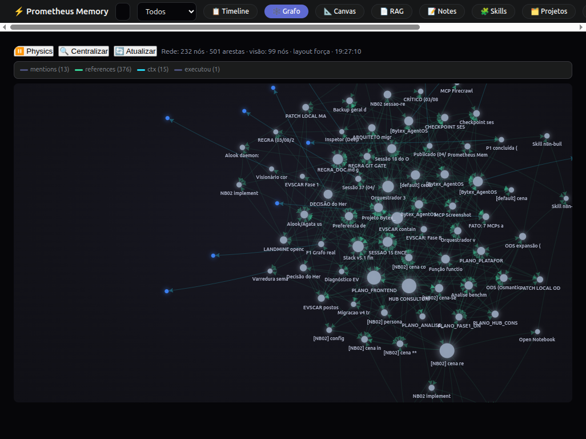
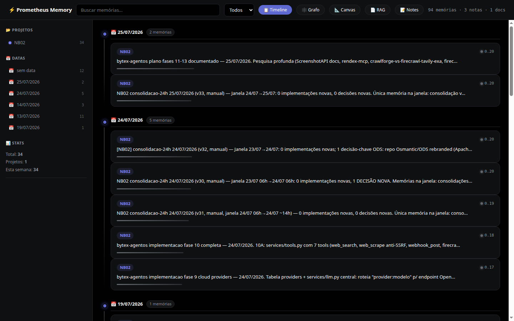
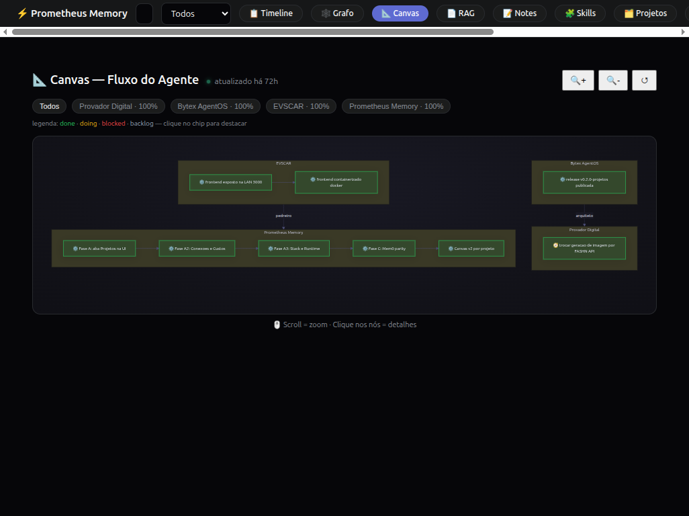
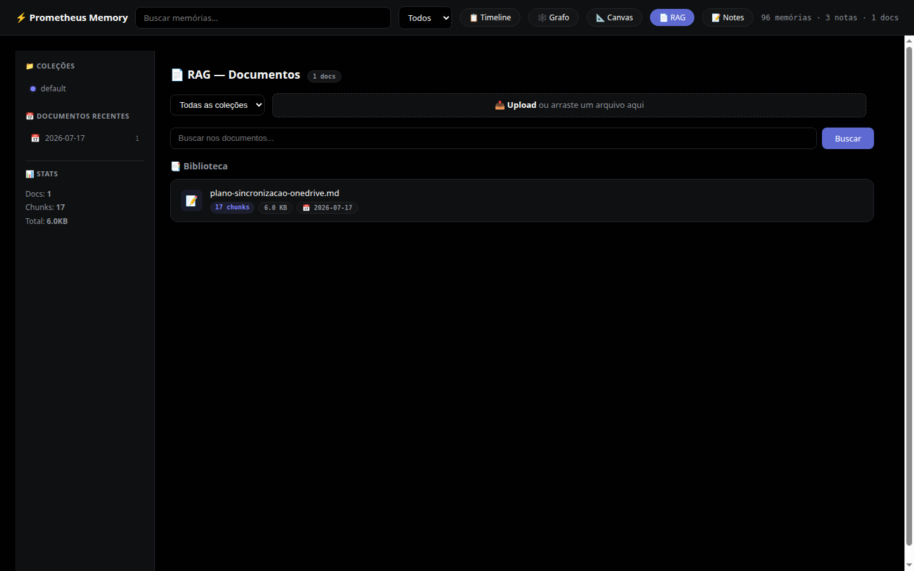
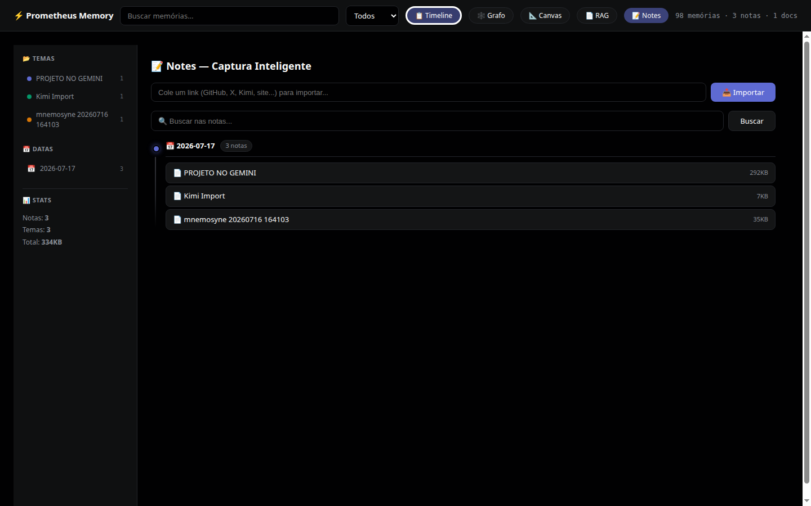
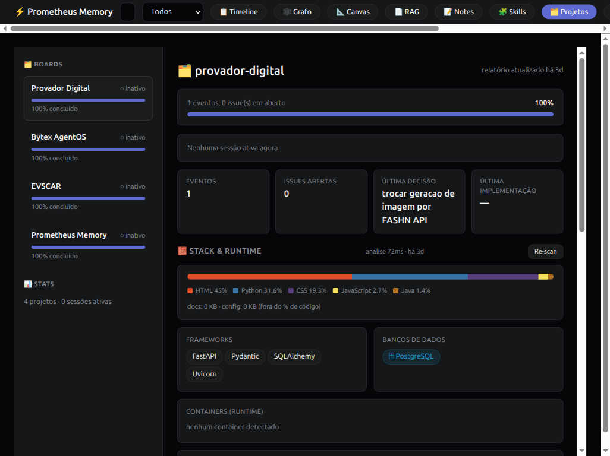

# ⚡ Prometheus Memory

> 🌐 **English** · [Português](docs/lang/README.pt-BR.md) · [Español](docs/lang/README.es.md) · [中文](docs/lang/README.zh-CN.md)

> L0→L3 memory pipeline for AI Agents — **the second brain for AI agents** (not the monitoring tool).
> Turns raw conversations into personas, skills and diagrams.
> Built on [Mnemosyne](https://github.com/abdiasrj/mnemosyne) (BEAM) + architecture inspired by TencentDB-Agent-Memory (L0→L3 pyramid).

[](LICENSE)
[](https://www.python.org/)
[](evals/REPORT.md)
[](https://github.com/abdiasrj/mnemosyne)

🌐 **English** | [Português](docs/lang/README.pt-BR.md) | [中文](docs/lang/README.zh-CN.md)

## Why "Prometheus"

In Greek mythology, Prometheus is the son of Mnemosyne (goddess of memory) —
the titan who brought the **fire of knowledge** to humanity. Mnemosyne stores
(memory); Prometheus transforms raw data into **actionable knowledge**
(persona, skills, diagrams).

## 🧠 Your Agents' Second Brain

**One brain, many agents.** Prometheus Memory works as a **shared second
brain** for all your AI agents. OpenCode, Claude Code, Cursor, Codex and
custom agents read and write to the **same memory** via MCP. A decision made
by agent A in the morning is available to agent B in the afternoon — nothing
is lost between sessions, tools or machines.

### 🔁 Built for Loop-Agents

Designed for **continuously running loop agents** (daily triage, monitoring,
24/7 automations): each loop iteration recalls what previous ones learned
(`mnemosyne recall`) and stores new facts when done (`mnemosyne remember`).
The L0→L3 pipeline consolidates everything automatically — every 6 hours
facts become scenes, weekly they become persona and skills. The agent
literally **gets smarter with every cycle**, with zero human intervention.

## Use Cases

- 🔁 **Loop-agents 24/7** — daily triage, X/Twitter monitors, watchers that learn from every run
- 🤝 **Multi-agent teams** — shared context across agents with different roles
- 📅 **Long-running projects** — dozens of sessions, zero context loss
- 🛠️ **Multiple AI tools** — one memory layer for your entire stack

## Features

- 🔍 **Hierarchical Timeline** — L3→L2→L1 drill-down, sidebar with projects/dates/stats
- 🕸️ **Knowledge Graph** — G6.js d3-force, Obsidian-style: glow, hover-activate, click → details; **real edges** (`ctx`, `references`, `mentions`, `executou`) with **PageRank + degree centrality** in pure Python, dense-mode collapse to hub subgraph
- 📐 **Mermaid Canvas** — auto-generated agent state diagram, zoom, click → offloaded content; **v2: multi-project subgraphs** (one block per project with event flow Backlog→Doing→Done, project chips, legend, cross-link to the Projects tab)
- 📄 **Multimodal local RAG** — upload PDF, TXT, MD, DOCX, PNG, JPG with automatic OCR (Tesseract), **vector search via sqlite-vec KNN (vec0)** over fastembed 384d float32
- 📝 **Notes** — URL import (GitHub, X/Twitter, websites) with sanitization and custom Markdown renderer
- ✏️ **Inline Editor** — edit and delete memories directly in the UI (7 tabs + editor modal)
- 🗄️ **Storage layer** — SQLite by default (WAL), PostgreSQL-ready interface (`DATABASE_URL`) landing in v0.2
- 💾 **Log offloading** — large tool outputs become refs (up to 61% token reduction)
- ⚡ **Live resource monitor** — real-time GPU/RAM/disk bars + process usage in the Timeline sidebar (updates every 3s)
- 🧠 **Skill generation** — detects recurring patterns in scenes and generates reusable skills
- 🗂️ **Projects tab (v0.2)** — per-project operational dashboard: kanban, timeline, progress bar and **real-time agent presence** (active/idle/stale via heartbeat), driven by lanes `sess:*`/`proj:*`/`agent:*` and `/api/pm/*` (idempotent `client_event_id`, Project Resolver with confidence)
- 🔑 **Connections & Costs (v0.2)** — per-project API keys/MCPs/subscriptions: read-only `.env` scan (SHA-256 fingerprint, **values never stored/exposed**), "paid but unused" and "expiring" alerts, shared-key detection, global monthly cost summary
- 🧱 **Stack & Runtime (v0.2)** — GitHub-style language bar (byte-counted, docs/config excluded), frameworks (monorepo-aware), databases (compose/DATABASE_URL), containers and git (branch/commits/dirty or "not versioned")
- 🧩 **Project skills (v0.2)** — Skill Builder detects patterns in project events → **draft** with evidence → human approval → `active` → promotion candidate to global
- 🧬 **Mem0 V3 patterns (v0.2)** — single-pass LLM extraction with temporal grounding ("today/yesterday" → absolute dates), SHA-256 dedup scoped per channel, entity linking and recall threshold
- 🎨 Dark mode, responsive, zero build step (no node_modules)

## Architecture

```
┌─────────────────────────────────────────────────────┐
│              Prometheus Web UI (:8777)               │
│  Timeline │ Graph │ Canvas │ Documents │ Notes │ Skills │ Projects │ ✏️  │
└─────────────────────────────────────────────────────┘
                          │
          ┌───────────────┼───────────────┐
          ▼               ▼               ▼
 ┌─────────────┐  ┌─────────────┐  ┌─────────────┐
 │ L3 Persona  │  │ L2 Scenes   │  │ L0 Sessions │
 │ (weekly)    │  │ (every 6h)  │  │(session end)│
 └─────────────┘  └─────────────┘  └─────────────┘
                          │
                     ┌────▼────┐
                     │   L1    │
                     │  Facts  │
                     │(auto-mem)│
                     └────┬────┘
                          │
               ┌──────────▼──────────┐
               │    Mnemosyne 3.12+  │
               │  SQLite + sqlite-vec│
               │  FTS5 + BEAM        │
               └─────────────────────┘
```

Full details in [ARCHITECTURE.md](ARCHITECTURE.md).

## Quick Start

### Prerequisites

- Python 3.10+
- Linux with systemd (for 24/7 service — optional)
- DeepSeek API key (for L2/L3 consolidation)
- Tesseract OCR (optional, for scanned PDFs and images)

### Install (1 command)

```bash
git clone https://github.com/hofstatter/prometheus-memory.git
cd prometheus-memory
python setup.py          # universal: Windows / macOS / Linux / Raspberry Pi
# or: bash setup.sh      (Unix wrapper)
```

The installer auto-detects your OS/arch, asks your **language** (en/pt/es/zh), installs dependencies and registers the Web UI per platform (systemd on Linux, launchd on macOS, Task Scheduler instructions on Windows).

### Platform support

| Platform | Status |
|---|---|
| Linux x86_64 | ✅ |
| Linux ARM64 / Raspberry Pi 5 | ✅ |
| macOS (Intel + Apple Silicon) | ✅ |
| Windows 10/11 (x64) | ✅ (native Python; OCR optional) |

### UI Languages 🌐

The Web UI auto-detects your browser language and supports **English, Português, Español and 中文** — switch anytime with the 🌐 selector in the top bar (persisted per browser). Set `PROMETHEUS_LANG` in `.env` to force a default. (The RAG tab renders as 检索增强 in Chinese.)

`setup.sh` installs dependencies, copies the pipeline scripts, installs the
auto-memory skill, creates cron jobs and enables the Web UI systemd service.

Then configure your keys:

```bash
nano ~/prometheus-memory/.env   # DEEPSEEK_API_KEY required
systemctl --user restart prometheus-web
```

Open: **http://localhost:8777**

### Manual install

```bash
pip install "mnemosyne-memory[all]>=3.12"
pip install -r requirements.txt
cp .env.example .env   # edit with your keys
set -a; . ./.env; set +a
python3 web/app.py     # http://localhost:8777
```

## Configuration

All options are environment variables — see [.env.example](.env.example):

| Variable | Default | Purpose |
|---|---|---|
| `DEEPSEEK_API_KEY` | — | **Required** for L2/L3 (scenes, persona, skills) |
| `PROMETHEUS_HOST` | `127.0.0.1` | Web UI bind (use `0.0.0.0` for LAN, at your own risk) |
| `PROMETHEUS_PORT` | `8777` | Web UI port |
| `MNEMOSYNE_HOME` | `~/.hermes/mnemosyne` | Mnemosyne data directory |
| `PROMETHEUS_NOTES_DIR` | `~/notes` | Notes directory |
| `PROMETHEUS_USER` | `$USER` | Name used in persona memories |
| `PROMETHEUS_PROJECT` | `geral` | Default project for memories |
| `PROMETHEUS_PASSWORD` | — | **UI login password** (required when bind ≠ localhost) |
| `PROMETHEUS_TOKEN` | — | API Bearer token for agents/scripts |
| `PROMETHEUS_PROTECT_READS` | `false` | `true` = entire UI requires login |
| `PROMETHEUS_PROJECTS` | — | Known projects (comma-separated) |
| `PROMETHEUS_EXCLUDE` | — | Content to hide from the UI (comma-separated) |
| `FIRECRAWL_API_KEY` | — | Scraping fallback (optional) |

## L0→L3 Pipeline

| Layer | Script | Frequency | Output |
|---|---|---|---|
| **L0** Sessions | `scripts/session_logger.py` | End of each session | Markdown per session |
| **L1** Facts | `auto-memory` skill | During the session | `mnemosyne remember` |
| **L2** Scenes | `scripts/memory_aggregator.py` | Cron every 6h | Thematic scenes + Canvas |
| **L3** Persona | `scripts/persona_synthesizer.py` | Weekly cron | `persona.md` + L3 facts |
| **Skills** | `scripts/skill_generator.py` | Weekly (with L3) | Skills in `~/.opencode/skills/generated/` |
| **Offloading** | `scripts/ref_manager.py` | On demand | `refs/*.md` with node_id |

## 🕸️ Knowledge Graph — Real Edges

The Graph tab (`/api/graph`) renders the **actual knowledge graph** extracted from
your Mnemosyne store — not an artificial projection:

- **Real edge types**: `ctx` (gist↔memory context), `references` (shared entity mentions),
  `mentions` (memory↔entity), `executou` (triple relations) — color-coded with a live legend
- **Analytics**: **PageRank + degree centrality** computed in pure Python (no new dependencies),
  exposed per node and used for hub ranking
- **Dense-mode collapse**: small graphs use a circular layout with permanent labels; large
  networks collapse to the **hub + entity subgraph** so the structure stays readable (see below)
- **Recall boost**: memory recall payloads include `graph_degree` — connected memories are
  surfaced alongside semantic scores



## Screenshots

| Timeline | Graph | Canvas | RAG | Notes | Projects |
|---|---|---|---|---|---|
|  |  |  |  |  |  |

## API (REST)

| Endpoint | Method | Description |
|---|---|---|
| `/health` | GET | Real health check (DB + embeddings + CLI) |
| `/api/timeline` | GET | Recent memories with project extraction |
| `/api/graph` | GET | Nodes/edges for the knowledge graph |
| `/api/canvas` | GET | Mermaid state diagram |
| `/api/search?q=` | GET | Memory recall |
| `/api/stats` | GET | Totals (memories, scenes, RAG docs, notes) |
| `/api/stats/resources` | GET | Live GPU/RAM/disk/process usage |
| `/api/stats/savings` | GET | Token savings estimate |
| `/api/context/briefing` | GET | ~500-token compressed session briefing |
| `/api/projects` | GET | Detected projects |
| `/api/memory/<id>` | GET/PUT/DELETE | Memory detail / update / delete |
| `/api/rag/collections` | GET/POST | RAG collections |
| `/api/rag/upload` | POST | Upload + index document (50MB max) |
| `/api/rag/search` | POST | Vector search |
| `/api/rag/documents` | GET/DELETE | List / delete documents |
| `/api/notes` | GET | List notes |
| `/api/notes/import` | POST | Import note from URL (SSRF-guarded) |
| `/api/notes/<path>` | GET/PUT/DELETE | Note CRUD |
| `/api/notes/search` | POST | Full-text note search |
| `/api/memory/remember` | POST | Store memory (accepts `infer` for LLM extraction + `project_slug`) |
| `/api/memory/recall` | POST | Recall (accepts `threshold` to filter low scores) |
| `/api/pm/sessions/start` / `heartbeat` / `close` | POST | Agent session lifecycle (presence) |
| `/api/pm/events` | POST | Canonical project event (idempotent via `client_event_id`) |
| `/api/pm/projects` | GET | Project boards (progress, active sessions) |
| `/api/pm/projects/<slug>/report` / `events` / `skills` | GET | Project report / events / skills |
| `/api/pm/projects/<slug>/stack` / `stack/scan` | GET/POST | Tech profile (languages, frameworks, DBs, git, containers) |
| `/api/pm/projects/<slug>/connections` / `connections/scan` | GET/POST | Connections (masked keys) + re-scan `.env` |
| `/api/pm/connections` | POST | Manual connection (billing/cost/expiry) |
| `/api/pm/connections/summary` | GET | Global monthly cost + unused/expiring alerts |
| `/api/pm/skills/<id>/approve` | POST | Human approval: draft → active |
| `/api/pm/entities` | GET | Extracted entities (mention counts) |

> **Note:** memory *writes* from agents also flow via the Mnemosyne CLI/MCP (shared store). `POST /api/memory/remember` is available since v0.2 with optional `infer=true` for Mem0-style extraction + dedup (falls back to raw storage if the LLM is unavailable).

## Security

- Defaults to `127.0.0.1` bind (no network exposure)
- **Login system**: when `PROMETHEUS_HOST != 127.0.0.1`, the UI asks for `PROMETHEUS_PASSWORD` once per browser (glass modal) and issues a 30-day HMAC session. Login endpoint is rate-limited (5 attempts/min/IP — even the correct password waits in the window)
- **API token**: agents/scripts use `Authorization: Bearer $PROMETHEUS_TOKEN` instead of the password login
- **Scopes**: default protects writes only (reads open); `PROMETHEUS_PROTECT_READS=true` protects the entire API (HTML shell stays public so the login modal can render)
- **Single-user, single shared store**: no per-agent isolation (trust boundary = local machine). Multi-tenant scoping lands in v0.2
- Path traversal protection on Notes endpoints
- SSRF protection on URL import, revalidated on every redirect
- XSS hardening: sanitized collection IDs, escaped code blocks, strict CSP headers
- No keys in source code — environment variables only
- HTML/JS sanitization on rendering (XSS)

## Skill Registry (Camada 1 — privada)

O Prometheus é também um **registry privado de skills** — sua "oficina" onde você cria, edita e itera skills pela UI, e qualquer IDE (OpenCode, Cursor, VSCode) sincroniza dele:

```bash
# inserir skill via API
curl -X POST localhost:8777/api/skills -H "Authorization: Bearer $TOKEN" \
  -d '{"name":"minha-skill","content":"# Minha Skill\nconteúdo"}'
# sincronizar p/ IDEs
prometheus-skills sync            # OpenCode (~/.config/opencode/skills/)
prometheus-skills sync --ide cursor
prometheus-skills list
```

- **Layer 1 (private):** your skills, editable via the UI (`🧩 Skills` tab), only you can write
- **🧩 Skills tab UI:** left sidebar (skill list, 📅 dates, 📊 stats) + content viewer with raw download and delete
- **Layer 2 (public/GitHub):** publish with `prometheus-skills publish <name>` when ready
- **External contribution:** via Pull Request on the repo (you approve the merge)

### Skill `ai-company` (16 senior analysts + development pipeline)

Included in the registry and in `skills/ai-company/`: 16 senior analysts guiding the user through **PRD (grill-me interview with checkpointing) → approval → Tech Spec (Frontend, Backend, Database) → Design Review → validation → Sprints → validation → delivery**, with human approval gates. Templates: `PRD.md`, `TECH_SPEC.md`, `SPRINT.md`, `VALIDATION.md`. Install globally in OpenCode (`~/.config/opencode/skills/ai-company/`) — works in every project and session.

**Embedded skills:**

| File | What it is | Credit |
|---|---|---|
| `design/super-designer/` | **Single design authority** — 20 commandments, 46 anti-patterns, 35 preflight checks, 3 dials (VARIANCE/MOTION/DENSITY). Every UI passes a mandatory Design Review gate | based on emilkowalski/skills, impeccable.style, tasteskill.dev |
| `GRILL.md` | Relentless PRD interview (1 question at a time) + **per-answer checkpointing** in `brainstorms/` | mattpocock/skills |
| `VIRAL.md` | 31 Principles of a Viral Product — launch compass, **brand lane only** (landing/pricing/marketing) | Marc Lou |
| `REVENUE.md` | Revenue-Centric Design — 101 conversion/pricing/churn principles. **License: attribution, no gambling** | @richardrx (heliocosta-dev) |
| `design/emil-design-eng.md` | Reference appendix — animation, gestures, clip-path, toasts, performance, a11y. **On divergence, super-designer wins** | emilkowalski |

**Decision hierarchy:** super-designer (visual/UX) > VIRAL (landing copy/structure) > REVENUE (revenue strategy). **Lane rules:** product lane (dashboards/apps) = super-designer alone; brand lane (landing/pricing) = super-designer + VIRAL + REVENUE.

## Integrations

Works with any MCP-compatible agent — **one shared memory for all your dev tools**:

```
OpenCode ─┐
Claude Code ─┼──► Mnemosyne MCP (:8765) ──► Prometheus Memory (same store)
Cursor ─────┤        ▲
Codex CLI ──┘   REST API (:8777) — /api/context/briefing, /api/memory/*
```

### Setup per tool

| Tool | Setup |
|---|---|
| **OpenCode** | See below (global = every session, or per-project) |
| **Claude Code** | `claude mcp add mnemosyne --transport sse http://localhost:8765/sse` |
| **Cursor** | `.cursor/mcp.json` → `{"mcpServers": {"prometheus": {"url": "http://localhost:8765/sse"}}}` |
| **Codex CLI** | `~/.codex/config.toml` → `[mcp_servers.mnemosyne]` `url = "http://localhost:8765/sse"` |
| **Any agent** | REST: `GET /api/context/briefing` (session start, ~500 tokens) + Mnemosyne CLI/MCP for writes |

#### MCP authentication

The Mnemosyne MCP server (`:8765`) requires a Bearer token (set in `MNEMOSYNE_MCP_TOKEN` on the service, or any token you choose when starting it). Pass it in the `headers` of your client config:

```json
"headers": { "Authorization": "Bearer <your-token>" }
```

#### OpenCode — global (recommended: works in every project)

`~/.config/opencode/opencode.jsonc`:

```json
{
  "$schema": "https://opencode.ai/config.json",
  "mcp": {
    "prometheus": {
      "type": "remote",
      "url": "http://localhost:8765/sse",
      "enabled": true,
      "headers": { "Authorization": "Bearer <your-token>" }
    }
  }
}
```

Plus the skill: `cp -r skills/auto-memory ~/.config/opencode/skills/auto-memory/`

> ⚠️ Note: `~/.opencode/skills/` is the **legacy** OpenCode path (≤2025). Current OpenCode loads global skills from `~/.config/opencode/skills/`. The installer copies to both for safety. Restart OpenCode after changing config (not hot-reload).

#### Multi-agent memory isolation (v0.2+)

Each agent gets an isolated memory channel (`agent-<id>`) — memories never leak between agents:

```bash
# write (isolated per agent)
curl -X POST localhost:8777/api/memory/remember -H "Authorization: Bearer $TOKEN"   -d '{"agent_id": "atlas", "content": "atlas prefers async python"}'
# recall (atlas sees only atlas memories)
curl -X POST localhost:8777/api/memory/recall -H "Authorization: Bearer $TOKEN"   -d '{"agent_id": "atlas", "query": "python"}'
# list agents with memory
curl localhost:8777/api/agents -H "Authorization: Bearer $TOKEN"
```

Shared context? Use `agent_id: ""` (the default shared channel).

#### Google Antigravity

Antigravity (Google's agentic IDE) supports MCP servers. Add to its MCP config (Settings → MCP Servers):

```json
{
  "mcpServers": {
    "prometheus": {
      "type": "sse",
      "url": "http://localhost:8765/sse",
      "headers": { "Authorization": "Bearer <your-token>" }
    }
  }
}
```

#### VSCode (Cline / Continue / Roo)

Any MCP-compatible extension works. Example for Cline (`cline_mcp_settings.json`):

```json
{
  "mcpServers": {
    "prometheus": {
      "type": "sse",
      "url": "http://localhost:8765/sse",
      "headers": { "Authorization": "Bearer <your-token>" }
    }
  }
}
```

#### OpenCode — per project

Drop `skills/auto-memory/` into `<project>/.opencode/skills/` and add the same `mcp` block to the project's `opencode.jsonc`.

A decision made by agent A in the morning is available to agent B in the afternoon — different tools, same memory.

## Token Savings

Prometheus is built to **reduce token spend**, not just store memories:

| Mechanism | How it saves |
|---|---|
| **Offloading** (`scripts/ref_manager.py`) | Large tool outputs (>500 chars) become `[ref:id]` refs — up to **61% token reduction** in context |
| **L0→L3 compression** | Raw facts consolidate into scenes and persona — recall injects ~40 fewer tokens per consolidated fact |
| **Context Briefing** | `GET /api/context/briefing` returns a ~500-token compressed summary (persona + scenes + recent facts) — start every session with maximum context at minimum cost |
| **Savings meter** | `GET /api/stats/savings` estimates total tokens saved (offloaded bytes ÷ 4 + compression) and shows a 💰 card in the UI sidebar |

## Comparison

See [COMPARISON.md](COMPARISON.md) — Mnemosyne vs MemPalace vs TencentDB vs Prometheus.

## Author

**Herbert Hofstatter** — [@hofstatter](https://github.com/hofstatter) · [X @hofstatter](https://x.com/hofstatter)

## License

MIT — see [LICENSE](LICENSE) and [NOTICE](NOTICE).
