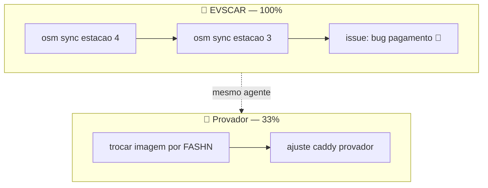

# PLAN — Canvas v2: visão por projeto (funcionalidade + design)

> **Data:** 03/08/2026
> **Autor:** Arquiteto (Kimi K3) + Pedreiro (DeepSeek V4 Flash)
> **Aprovado por:** Herbert (defaults confirmados 03/08)
> **Classificação:** MEDIUM (UI + gerador novo + fonte estruturada)
> **Status:** Plano criado — aguarda execução (sessão Pedreiro dedicada)
> **Backup:** `~/backups/prometheus-memory/plano-canvas-v2/20260803-233020/`

---

## 1. Contexto e diagnóstico (confirmado no código)

| Item | Estado atual | Problema |
|---|---|---|
| Gerador | `scripts/memory_aggregator.py::generate_mermaid_canvas()` | **Linha única** `[*] → Start → S0 → … → Concluido`; **ignora projeto** (mistura tudo) |
| Fonte | Memórias via subprocess `mnemosyne recall` + regex de ação (`extract_action`) | Frágil (parse de texto) |
| API | `web/app.py::/api/canvas` → `{mermaid, age}` | OK — backward compatible |
| Frontend | `index.html` + Mermaid v11 + zoom (`transform: scale`) + painel de detalhe do nó | Funciona; sem filtro/legenda/cross-link |
| Dados novos | `prometheus_project_events` (v0.2, com `project_slug`/`event_type`/`status_hint`/`title`) | **Fonte estruturada ideal** |

## 2. Objetivo

Transformar o 📐 Canvas em **visão multi-projeto**: um subgraph por projeto (EVSCAR, Provador Digital, Prometheus, Bytex...) com o fluxo real Backlog→Doing→Done, mantendo **fallback** ao gerador atual (v1) quando não houver eventos — o Canvas nunca fica vazio.

## 3. Decisões (defaults aprovados por Herbert)

1. **Fonte**: híbrida — `prometheus_project_events` quando existirem; senão cenas/memórias (v1) → Canvas nunca vazio.
2. **Render**: `flowchart TD` + `subgraph <PROJETO>` (suporte/layout melhores que composite states do `stateDiagram-v2`).
3. **Interatividade**: chips de filtro por projeto + detalhe de nó enriquecido + legenda por tipo.
4. **Cross-link**: clique no nó → detalhe → "ver painel do projeto" (aba 🗂️ com o projeto selecionado).

## 4. Arquitetura

### Fluxo de dados
```
prometheus_project_events (por slug) ─┐
prometheus_projects (nome/repo)       ├─> scripts/canvas_generator.py
memórias/cenas (fallback v1)          ┘        │
                                       gera mermaid multi-projeto
                                               │
                                    ~/.hermes/mnemosyne/canvas.mmd
                                               │
                              web/app.py /api/canvas {mermaid, age, mode}
                                               │
                              index.html + static/canvas.js (render + chips + legenda + detalhe)
```

### Render (Mermaid v11 — flowchart TD + subgraphs)


## 5. Arquivo-a-arquivo

### 5.1 `scripts/canvas_generator.py` (novo)

```python
def generate(project_events: dict, projects: list, fallback: str) -> str:
    """Mermaid multi-projeto (flowchart TD + subgraphs).
    project_events: {slug: [eventos]} · projects: [prometheus_projects]
    fallback: mermaid v1 (cadeia atual) se não houver eventos.
    Retorna o texto mermaid."""

def main() -> int:
    """Lê prometheus_project_events + prometheus_projects, gera e grava canvas.mmd.
    Standalone (chamável pelo aggregator e pelo cron)."""
```

- Lê `prometheus_project_events` (por slug, ordenado por `created_at`) + `prometheus_projects` (nome/color/repo_path).
- Nós: `title` truncado (~40 chars, sanitizado) com `event_type`; `status_hint` → classe `done/doing/blocked/backlog`.
- Arestas: sequência por `created_at` dentro do subgraph; aresta pontilhada entre projetos quando o mesmo `agent_id`/`harness` toca os dois.
- Máx ~5 nós por subgraph (evita layout quebrado); sem eventos → retorna `fallback` (v1 atual).
- `main()` grava em `CANVAS_FILE` (`~/.hermes/mnemosyne/canvas.mmd`).

### 5.2 `web/app.py` — `/api/canvas` (estender, backward compat)

- Mantém `{mermaid, age}` + novo campo `mode: "projects" | "legacy"`.
- Novo `GET /api/canvas/projects` → `{projects: [{slug, name, progress, mermaid}]}` (v2.1, filtro por projeto).

### 5.3 `web/templates/index.html` + `web/static/canvas.js` (novo)

- **Chips de projeto** no topo (de `/api/pm/projects`): nome + dot de presença + % progresso; clique **destaca** o subgraph (dim nos demais) — v2.1: carrega `/api/canvas/projects/<slug>`.
- **Legenda** por `event_type` (cores semânticas: decision/implementation/issue/research).
- **Detalhe do nó**: tipo, status, harness/agente, data, conteúdo da memória (`/api/memory/<id>` quando `memory_id`) + botão **"ver painel do projeto"** → `showProjects()` + `selectPMProject(slug)`.
- Zoom por `transform: scale` mantido; empty state por projeto.
- `escapeHtml()` em todo dado dinâmico; cliques via `data-*` + delegação (padrão `projects.js`).

### 5.4 `scripts/memory_aggregator.py` (hook, ~2 linhas)

- No lugar de chamar `generate_mermaid_canvas()` diretamente, chamar `canvas_generator.main()` — v1 vira o fallback interno do gerador novo.

### 5.5 `tests/test_canvas_generator.py` (novo)

- **T1**: eventos de 2 projetos → mermaid contém `subgraph EVSCAR` e `subgraph PROVADOR` + `classDef` por status.
- **T2**: sem eventos → retorna o fallback v1 (cadeia).
- **T3**: mermaid válido (começa `flowchart TD`; sanitização não quebra sintaxe).
- **T4**: API `/api/canvas` retorna `mode` correto.

## 6. Design (super-designer)

```text
Lane: product · VARIANCE: 5 · MOTION: 3 · DENSITY: 6
Palette: tokens atuais (Linear dark) · Accent só p/ projeto selecionado/foco
```

- Chips de projeto com dot de presença + % (mesmo padrão do board da aba Projetos).
- Cores semânticas por `event_type`/`status` via `classDef` com alpha (sem glow, sem gradiente).
- Zero sombra como elevação (surface + hairline); zoom via `transform: scale`; empty state claro.
- Todo texto dinâmico passa por `escapeHtml()`; cliques via `data-*` + delegação (sem interpolação em `onclick`).

## 7. Testes e validação

- `pytest tests/ -q` verde (inclui `test_canvas_generator.py`).
- `node --check web/static/canvas.js` OK.
- Screenshot Playwright (multi-projeto renderizado) + varredura Visionário (após restart do OpenCode — model fix `MiniMax-M3` já aplicado).

## 8. Critérios de aceite

1. Canvas mostra **um bloco por projeto** com fluxo Backlog→Doing→Done (eventos reais) e **fallback v1** quando sem eventos.
2. Chip filtra/destaca o projeto; nó abre detalhe + link "ver painel do projeto" (aba Projetos selecionada).
3. Mermaid renderiza sem erro (v11); testes de geração passam.
4. `pytest` verde + screenshot valida o multi-projeto.
5. Docs atualizados (linha da feature Canvas nas 4 línguas) + STATE/CONTEXT.

## 9. Riscos e mitigações

| Risco | Mitigação |
|---|---|
| Mermaid `subgraph` quebra layout com muitos nós | máx 5 nós/subgraph + `flowchart TD`; fallback v1 |
| Produção com 0 eventos → Canvas vazio | fallback v1 automático (sempre tem conteúdo) |
| `index.html` monolítico cresce | novo `static/canvas.js` (padrão `projects.js`) |
| Cross-link entre abas | `showProjects()` + `selectPMProject` já existem e são globais |

## 10. Ordem de execução

```
1. scripts/canvas_generator.py + fallback (2-3h)
2. /api/canvas extend + /api/canvas/projects (1h)
3. Canvas view + static/canvas.js — chips, legenda, detalhe, cross-link (3-4h)
4. aggregator hook + tests/test_canvas_generator.py (1h)
5. screenshot + docs 4 línguas + produção sync + restart (1h)
```

**Estimativa:** ~8-10h (2 sessões Pedreiro + 1 Inspetor na fronteira).

## 11. Pós-implementação

- Docs: `docs/ROADMAP.md` (Canvas v2 ✅), `CHANGELOG.md`, `ARCHITECTURE.md` (canvas_generator), README EN + espelhos pt-BR/zh-CN/es (linha da feature Canvas).
- `~/Projetos/Bytex_AgentOS/STATE.md` (sessão) + `CONTEXT.md`.
- Gravar no Mnemosyne: "Prometheus v0.3 — Canvas por projeto (subgraphs por project_slug, fallback v1)" (source `decisao`, importance 0.9, scope global).

## 12. Referências

- Gerador atual: `scripts/memory_aggregator.py` (`generate_mermaid_canvas`, `extract_action`, `group_by_project`)
- API canvas: `web/app.py::canvas()` (linhas ~186-207)
- Frontend canvas: `web/templates/index.html` (`renderCanvas`, `handleCanvasClick`, `canvas-view`)
- Padrão de UI nova: `web/static/projects.js` (delegação `data-*`, `escapeHtml`)
- Dados: `prometheus_project_events` / `prometheus_projects` (sidecar `web/prometheus_db.py`)
- Mermaid v11: `https://mermaid.js.org/syntax/flowchart.html`
