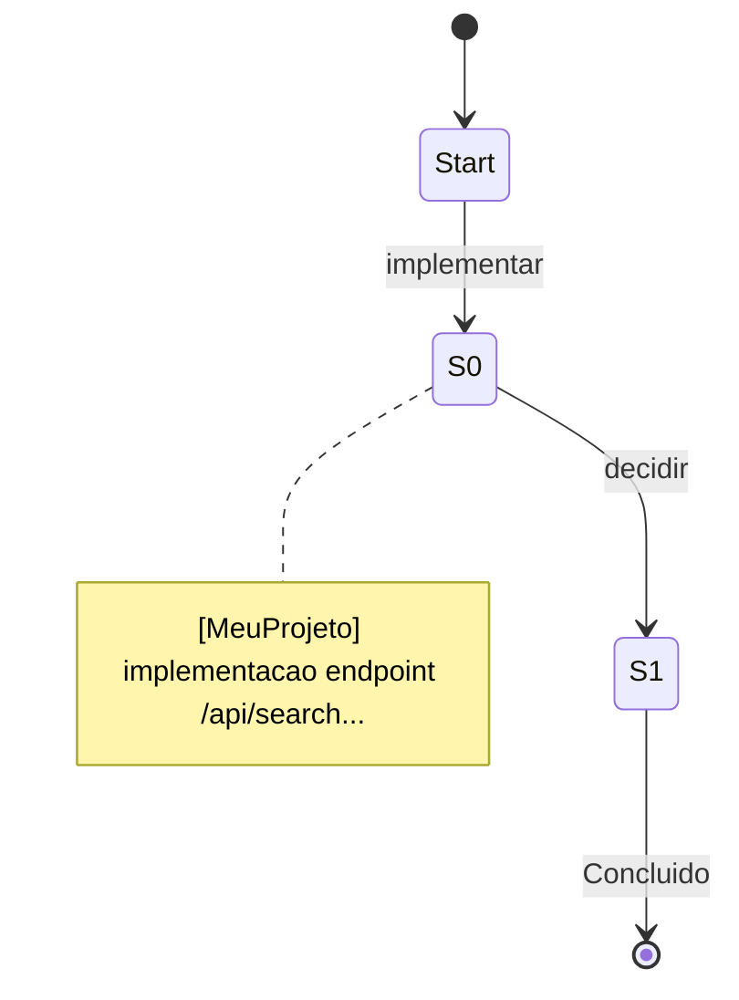

# Exemplo de Sessão — Tracing L0→L3

Este arquivo mostra como uma sessão típica flui pelo pipeline do Prometheus
Memory.

## L0 — Captura da sessão (fim da sessão)

```bash
python3 ~/bin/session_logger.py "MeuProjeto" \
  "Implementado endpoint de busca com cache Redis" \
  "criar endpoint,adicionar cache,escrever testes" 12500
# → SID: session_20260721_143022
# → ~/.local/share/opencode/sessions/MeuProjeto_session_20260721_143022.md
```

## L1 — Fatos gravados durante a sessão (auto-memory skill)

```
[MeuProjeto] implementacao endpoint /api/search com cache Redis — 21/07/2026
[MeuProjeto] decisao usar Redis em vez de Memcached pelo suporte a TTL por chave — 21/07/2026
[MeuProjeto] config requirements.txt adicionado redis==5.0 — 21/07/2026
```

## L2 — Cena gerada pelo aggregator (cron, a cada 6h)

```
[MeuProjeto] cena cache-redis-api-search: endpoint de busca implementado
com cache Redis (TTL por chave), dependência adicionada e testes escritos
— 21/07/2026
```

Mais o Canvas Mermaid atualizado em `~/.hermes/mnemosyne/canvas.mmd`:



## L3 — Persona sintetizada (cron, semanal)

```
[MeuProjeto] persona joao perfil-sintese semana 21/07/2026: desenvolvedor
backend Python/Flask, prefere Redis para cache, trabalha com testes
automatizados, stack PostgreSQL + Docker...
```

## Skills — geradas quando 5+ cenas acumulam

Se o padrão "adicionar cache em endpoint" aparecer 3+ vezes nas cenas:

```markdown
# skill: cache-endpoint-redis
# auto-generated by Prometheus Memory

## Gatilhos
- "adicione cache nesse endpoint"
- "esse endpoint está lento"

## Fluxo de trabalho
1. Identificar o handler do endpoint
2. Envolver com decorator de cache Redis (TTL configurável)
3. Adicionar invalidação no write path
4. Escrever teste de cache hit/miss
```
